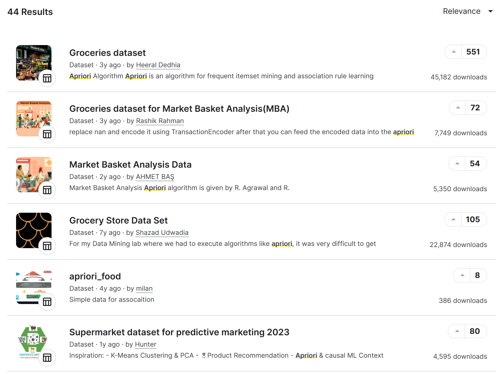
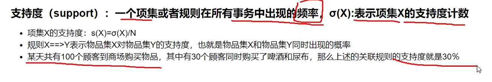
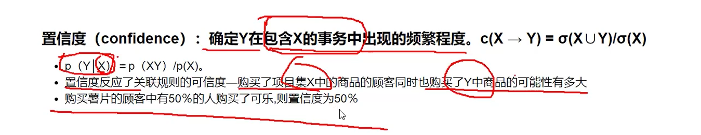
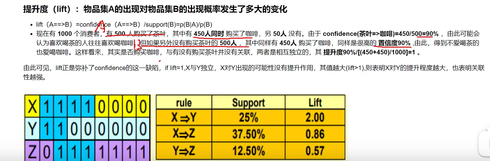

# 项目介绍

本项目仅用于中国科学院大学沈阳计算所，个人研一课程汇报Apriori算法部分，如有错误欢迎指正。
**作者：developer_zxh**

# 项目目录

- code：项目源码目录
  - data: 数据集
    - [Groceries_dataset.csv：购物篮数据](code%2Fdata%2FGroceries_dataset.csv)
    - [tcm.json：补虚中药方剂目录](code%2Fdata%2Ftcm.json)
    - [tcm_detail.json：补虚中药方剂详情](code%2Fdata%2Ftcm_detail.json)
  - [graph_les_miserables.html:购物篮可视化](code%2Fgraph_les_miserables.html)
  - [graph_les_miserables_tcm.html：补虚中药成分可视化](code%2Fgraph_les_miserables_tcm.html)
  - [shopping basket.ipynb：购物篮实现](code%2Fshopping%20basket.ipynb)
  - [tcm.ipynb：中药实现](code%2Ftcm.ipynb)
  - [爬取中药方剂目录.py](code%2F%C5%C0%C8%A1%D6%D0%D2%A9%B7%BD%BC%C1%C4%BF%C2%BC.py)
  - [爬取中药方剂详情.py](code%2F%C5%C0%C8%A1%D6%D0%D2%A9%B7%BD%BC%C1%CF%EA%C7%E9.py)

# ppt目录

## 总结机器学习处理步骤

### 数据获取与清洗

### 探索性数据分析

### 特征工程和选择

### 比较不同机器学习模型

### 对最佳模型执行超参数调整

### 最佳模型评估

### 模型结果解读

### 得出结论

#### 数据集获取

https://www.kaggle.com/datasets/heeraldedhia/groceries-dataset

#### 爬取补虚中药

药方目录：
http://zhongyaofangji.com/zhuzhi/buxu.html

药房详情：
http://zhongyaofangji.com/b/baifanwan.html

爬

以下内容仅供个人学习使用，可以忽略。

##  捐赠

如果你觉得这个项目帮助到了你，可以帮作者买杯奶茶或者加个鸡腿🍗表示鼓励。

   
	
    

 

<!-- #end -->